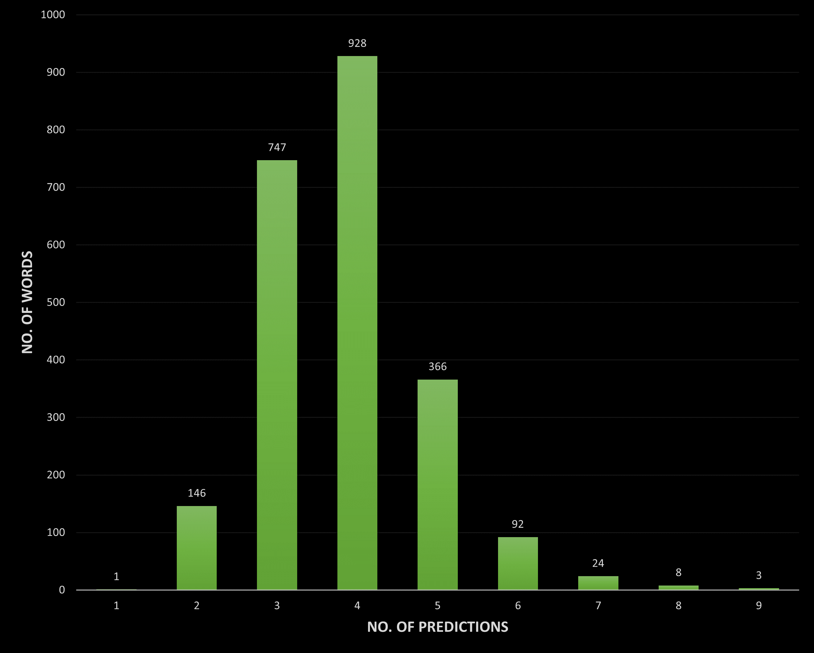

# Project WAR

**WAR** stands for **W**ordle **A**nswer and **R**esolver

## About

> [Wordle](https://www.powerlanguage.co.uk/wordle/) is a web-based word game developed by Welsh-born software engineer Josh Wardle, formerly an employee of Reddit. Players attempt to guess a five-letter word in six attempts; feedback, in the form of colored tiles, is given for each guess, informing players which letters are in the correct position and which are in other positions of the answer word. [(source)](https://en.wikipedia.org/wiki/Wordle)

We have built a solver from scratch that makes use of logic based on the rules of the game, a simple algorithm and a couple of primitive data structures to solve Wordle. There's no search or decision trees, learning models or intelligent agents; just plain old DSA. The algo has still managed to reach avg. levels of predictions that are less than 0.45 away from the [best known automated solver](https://jonathanolson.net/wordle-solver/).

## Stats

- Time taken to build: 5 hours
- Average no. of predictions required: 3.83888
- Average time taken to solve: < 200 microseconds
- No. of words failed (i.e. take more than 6 predictions): 35

## Tech

- [C++](https://en.cppreference.com/w/cpp/14) - Written in C++ 14

- [CLion](https://www.jetbrains.com/clion/download/#section=windows) - A cross-platform IDE for C and C++

## Usage

1. Compile and run `WAR.cpp`.
2. Use the prediction provided by the algorithm.
3. Enter the feedback in the form of "BYGBY", where
   - `B` stands for black/grey.
   - `Y` stands for yellow.
   - `G` stands for green.
4. Repeat until you win.

## Author

[Yeluri Ketan](https://github.com/YeluriKetan) - Undergraduate, Computer Science, NUS '24

[Avinash Changrani](https://github.com/nabobery) - Undergraduate, Computer Science, IIITDM Kancheepuram '24